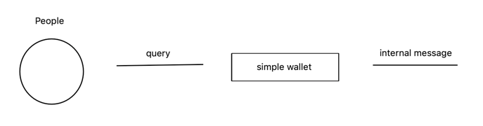
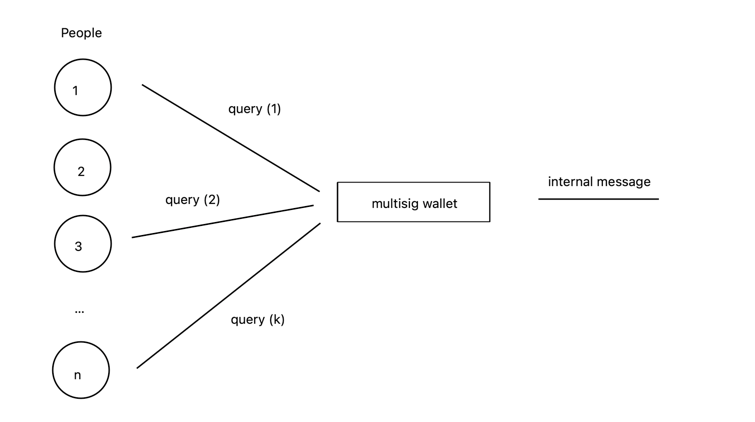

# Multisignature Wallet

Схема отправления сообщения с обычного кошелька (v2/v3/v4/highloads):

Минусы обычного кошелька в том, что сообщения подписываются только 1 приватным ключом, 
который может быть украден или забыт, тем самым контроль над кошельком будет утерян.

Мы хотим обезопасить себя и распределить ответственность отправки сообщений с кошелька между n людьми.
Значит нам нужно n различных связок pub_key/priv_key ключей для n людей и дать им возможность подтверждать
транзакции на кошельке, как off-chain, так и on-chain.

На помощь приходит кошелек с мультиподписями.

Схема отправления сообщения с кошелька с мультиподписью:

