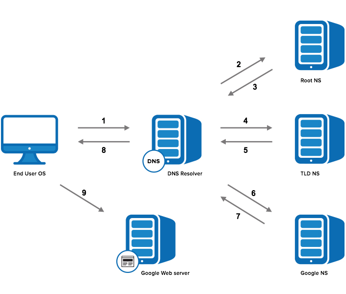

# DNS smart-contract

[Ссылка на видео урок](https://youtu.be/fdvS3G06G6Q)


## Для чего вообще DNS? 
Для удобства. Чтобы не запоминать строки-адреса длинной 48 символов (в случае web2 это ip). 
Можно ввести человекочитаемую строку и получить адрес нужного ресурса. (в нашем случае адрес смарт контракта / adnl сайта / тд)

### Процесс распознавания в web2



На примере driver.google.com.
- *Root - "."*
- *TDL (top-level domain) - .com*
- *Google - driver.google*

Путь распознавания:
- Ваш ПК идет в локальный файл hosts ищет там
- Если не нашел, идет на локальный DNS Сервер провайдера
- Если не нашел, идет на сервера географических зон 

Как только нашел, получает ip адрес, на который и посылается запрос.


## Информация из TIPs

### Ограничения
- строка длинной до 126 байтов. Из-за того, что складируется как store_ref, без доп обработки. Значит макс 1023 / 8 == 127.875 ~= 127 
- case-sensitive, но нет смысла регистрировать WaLlEt так как все сервисы буду преобразовывать в wallet
(в смарте увидим, что он вам WaLle и не даст зарегать)

### Внутреннее представление домена

Делятся по ".", добавляется нулевой символ "\0", собирается в обратном порядке.

Пример: driver.google.com -> com\0google\0driver\0

На текущий момент только .ton считается валидным доменом первого уровня. 
Можно добавить любые другие, главное, чтобы они не совпадали с уже существующими, 
например google.com, чтобы нельзя было украсть куки.

## Smart-contract

### DNS Root
Его адрес можно вытащить из configuration params, которые лежат в master chain, имеют в качестве ключа 32 бита, 
значение всегда Cell. Если отсутствует, то Null. С конфигом можно общаться, 
он лежит в C7 при запуске любой транзакции. (увидим в коде, как это можно сделать)


### Get method dns_resolve 
Вызывается с двумя параметрами:
- subdomain: строка из 8n битов, которые содержат внутреннее представление. (N <= 127)
- category: целое число из 256 бит содержащее sha256 hash от строки. (К примеру, sha256(“dns_next_resolver”)) Если отправляем тут 0, то вернуться все возможные категории.


Возвращаемые значения:
- длину 8m найденного префикса 0 < m <= n
- Cell - DNSRecord (https://github.com/ton-blockchain/ton/blob/master/crypto/block/block.tlb#L817) для указанного домена и указанной категории. 
  Либо словарь с 256 ключами и DNS Record значения

  
*Запрашивать \0 валидно, в таком случае контракт может вернуть запрашиваемую категорию в его DNS записях*

### DNS Collection, DNS item
Реализация *.ton доменов сделана в виде nft. Распознаватель .ton доменов сделан в виде nft minter’а, 
а сами домены сделаны в виде nft item’ов. Поэтому ими можно торговать на marketplace’ах и "передавать" между кошельками. 


## Рекомендуемый порядок разбора кода
1. dns-utils.fc
2. dns-root.fc
3. dns-minter.fc
4. dns-item.fc


## Дополнительно
Пример получения значений для utf-8 строки
```bash
$ python -c "print([ord(c) for c in 'ton'])"
```

Получение символа по его коду
```bash
$ python -c "print(chr(45))"
```
